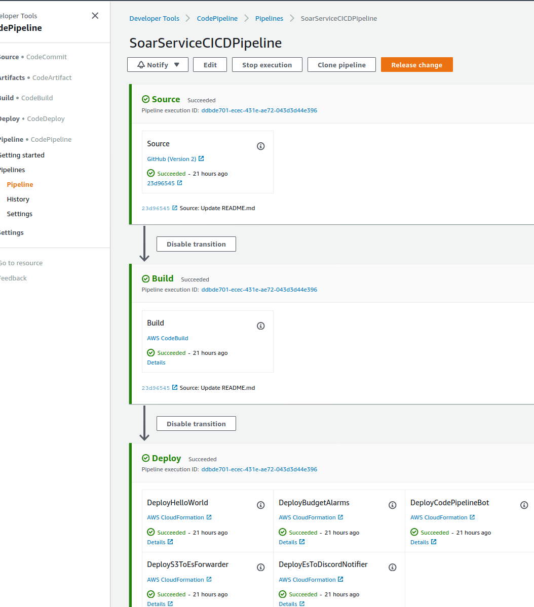
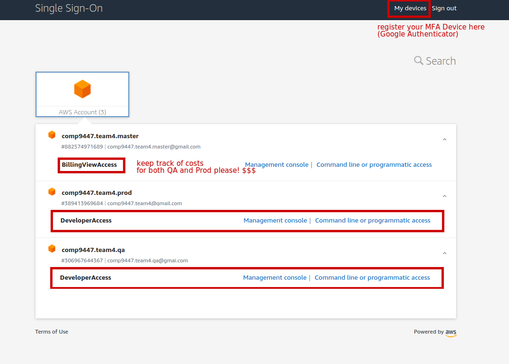

# COMP9447 Team 4 - 2020T3 - SOAR

The main repo for the SOAR project (COMP9447 Team4)

```
Team 4 (Mythical Mysfits)
Mentor: Paul Hawkins
Tutor: Chong Yew Chang

Members:
Nathan Driscoll
Justin Ty
Sarah Ailin Liu
Yunsar Jilliani
Keung Lee
Elton Wong
Evangeline Endacott
William Yin
Chirag Panikkasseril Unni
Shiyuan Liang (Steve)
```

# Build Status

Service | Status
---| ---
Soar | 
MythicalMysfitsService |  
MythicalMysfitsStreamingService |  
MythicalMysfitsQuestionsService |  


# Directory Structure

```
bin/ - shell scripts (use this as an entry point)
infra/ - cloudformation templates
mythical-mysfits/ - code related to the sample app
services/ - our custom use cases written with Lambdas and AWS SAM
```

# Quick start

```
➜  soar git:(master) ✗ AWS_PROFILE=qa ./bin/soar-stack.sh --help
In environment: qa
Not a valid argument...
Manages CFN stacks for the SOAR solution.
Usage: AWS_PROFILE=qa ./bin/soar.sh <arg>

Where arg is:

create-cicd
create-cloudtrail
create-es
create-waf-stack

(There are more options if you checkout the shell script, eg: updating stacks etc)

```

# Deploying ElasticSearch

```
# Deploy the S3 To ES Lambda Forwarder
cd services/s3-to-es-forwarder
sam deploy --guided

# Go back to repo root
cd ../..

# Use the soar-stack.sh script to deploy cloudtrail and es
./bin/soar-stack.sh create-cloudtrail
./bin/soar-stack.sh create-es
```

# Deploying Custom Lambdas

These can be deployed manually using AWS SAM: https://docs.aws.amazon.com/serverless-application-model/latest/developerguide/sam-cli-command-reference-sam-deploy.html

```
# Go to the service
cd services/budget-alarms
sam deploy --guided
```

Or use the ci/cd with CodePipeline. 

`./services/buildspec.yml` is setup with our Github repo and AWS accounts.




# Deploying Mythical Mysfits

```
➜  soar git:(master) ✗ AWS_PROFILE=qa ./bin/mythical-mysfits.sh --help
Reference: https://github.com/aws-samples/aws-modern-application-workshop/tree/python

Where arg is:

create-module-1
create-module-2
create-module-3
create-module-4
create-module-5

```

# User Setup

## AWS SSO

I'll send an email via AWS SSO. Follow the email instructions and add an MFA device.

Our portal can be found in:
https://comp9447-team4.awsapps.com/start

You would need an MFA device to login. Register with Google Authenticator on your phone and scan the QR code.

If you've set it up properly, you would be able to login to the console and see this:



Use the `developer` role for normal use and `billing` to keep track of $.

## AWS CLI V2

Install AWS CLI 2. Version 2 is required for AWS SSO.

https://docs.aws.amazon.com/cli/latest/userguide/install-cliv2.html

## AWS SSO CLI setup

To use the CLI with SSO, see:
https://docs.aws.amazon.com/cli/latest/userguide/cli-configure-sso.html


Once logged in via SSO, configure your AWS CLI in a terminal:

```sh
aws configure sso
SSO Start URL: https://comp9447-team4.awsapps.com/start
SSO Region: ap-southeast-2

<This will take you to a browser to login via SSO>
<Once logged in, it will then ask you to select qa or prod. Select qa to start with>

CLI default client Region: us-east-1 
  --> THIS IS IMPORTANT! All our development work must be in us-east-1 to get the latest resource features
CLI default output format: json
CLI profile name [CLI profile name [DeveloperAccess-306967644367]]: qa
  --> THIS IS IMPORTANT! Otherwise you might have to type in a very long profile name...
```


To test this, run this command in `qa`:

```
aws s3 ls --profile qa
```

Verify that this is what is in your `~/.aws/config` file.

```
[profile qa]
sso_start_url = https://comp9447-team4.awsapps.com/start
sso_region = ap-southeast-2
sso_account_id = 306967644367
sso_role_name = DeveloperAccess
region = us-east-1
output = json

[profile prod]
sso_start_url = https://comp9447-team4.awsapps.com/start
sso_region = ap-southeast-2
sso_account_id = 389413969684
sso_role_name = DeveloperAccess
region = us-east-1
output = json
```

## Having issues with SSO?

Login again
```
aws sso login --profile qa
```

If the above doesn't work, remove the cache and retry.

```
mv ~/.aws/sso ~/.aws/sso.bak
mv ~/.aws/config ~/.aws/config.bak
rm -rf ~/.aws/cli/cache
rm -rf ~/.aws/sso/cache

aws configure sso
# Repeat steps above

# Clean up if successful
rm -rf ~/.aws/sso.bak
rm -f ~/.aws/config.bak
```

# Repo prerequisites

These are written in `bash` which glues together AWS commands. This works best under Linux / MacOS.

This varies by OS but these instructions are for a Debian / Ubuntu based system.
You can also use `brew` for MacOS or Chocolatey for `Windows`.

If you have Windows, it is recommended to use a Virtual Machine instead with Linux for best compatability with bash.

See: https://www.virtualbox.org/


## AWS CLI v2
See above.

## Jq
json parsing for API calls

```
sudo apt install jq
```

## Direnv
Setup direnv for environment variables. This is used for substituing environment variables to params.
It's optional, you can just set your environment variables as in `.envrc-demo`.
```
sudo apt install direnv

cp .envrc-demo .envrc
direnv allow

echo 'eval "$(direnv hook zsh)"' >> ~/.zshrc

# DO NOT COMMIT YOUR .envrc
```

## Docker
https://docs.docker.com/engine/install/ubuntu/

This is required by AWS SAM.

## AWS SAM
Used for deploying lambdas for Mythical Mysfits. We can also use this for our own deployments for the SOAR solution.


https://docs.aws.amazon.com/serverless-application-model/latest/developerguide/serverless-sam-cli-install-linux.html

```
# install brew
/bin/bash -c "$(curl -fsSL https://raw.githubusercontent.com/Homebrew/install/master/install.sh)"

test -d ~/.linuxbrew && eval $(~/.linuxbrew/bin/brew shellenv)
test -d /home/linuxbrew/.linuxbrew && eval $(/home/linuxbrew/.linuxbrew/bin/brew shellenv)
test -r ~/.bash_profile && echo "eval \$($(brew --prefix)/bin/brew shellenv)" >>~/.bash_profile
echo "eval \$($(brew --prefix)/bin/brew shellenv)" >>~/.profile

brew --version

# Install AWS SAM
brew tap aws/tap
brew install aws-sam-cli

sam --version
```

# AWS Region choice

`us-east-1` was chosen as the main AWS REGION to make it easier to deploy resources. This region is expected to get the latest features.

With the exception of SSO. Our initial stack for SSO ONLY is deployed on `ap-southeast-2`.